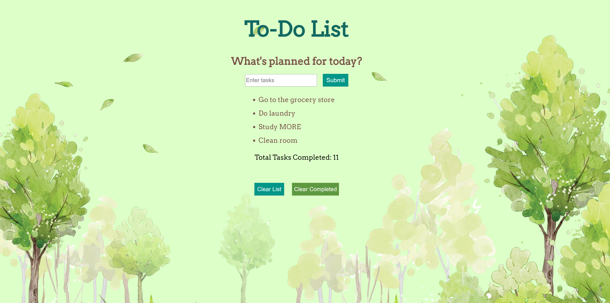

Live Code: 

# How It's Made:
### Tech used: 
HTML, CSS, JS, EJS & MongoDB

### Lessons Learned:
Learned how to create counter of completed tasks from the database as well as using style attribute in the ejs to influence color of text.

## Installation

1. Clone repo
2. run `npm install`

## Usage

1. run `npm run savage`
2. Navigate to `localhost:3000`

# Examples:

Take a look at these couple examples that I have in my own portfolio:

Anime Forum: https://github.com/Kim-Flores/AnimeForum-Fullstack

Journal: https://github.com/Kim-Flores/Journal-Fullstack

Quotes: https://github.com/Kim-Flores/Quotes-Express
